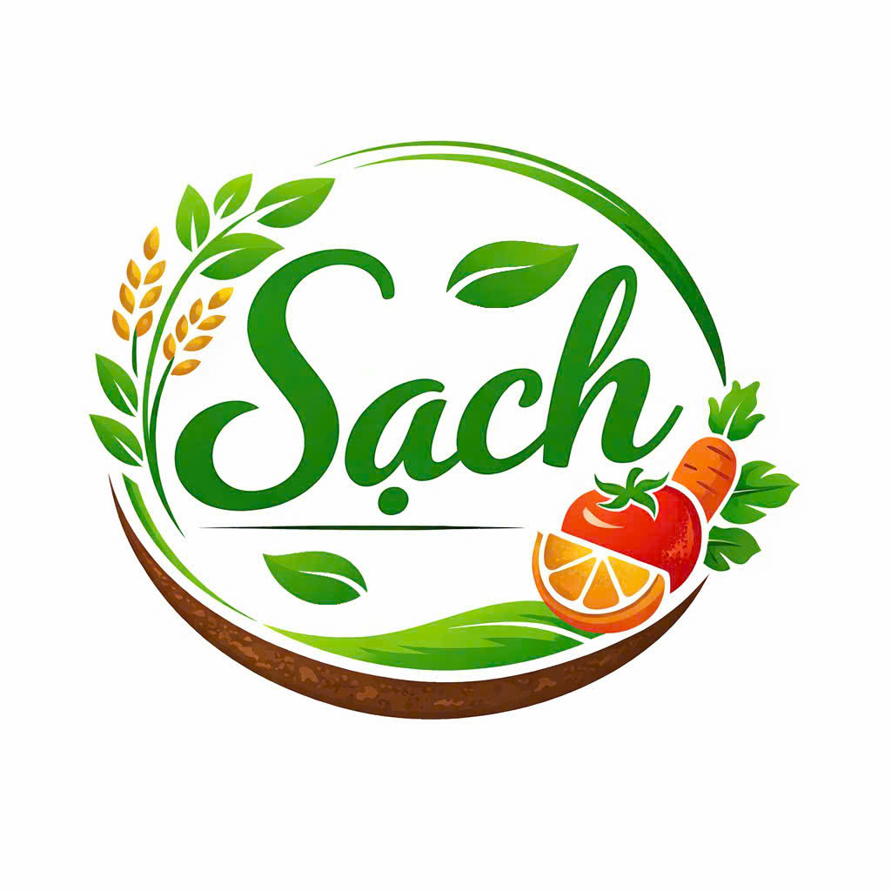
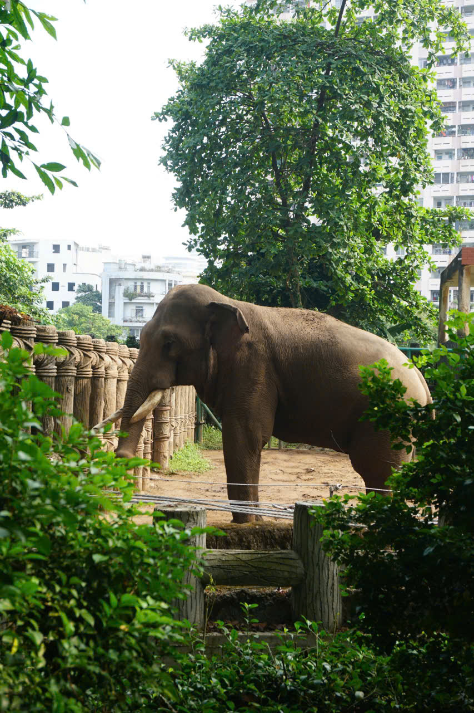
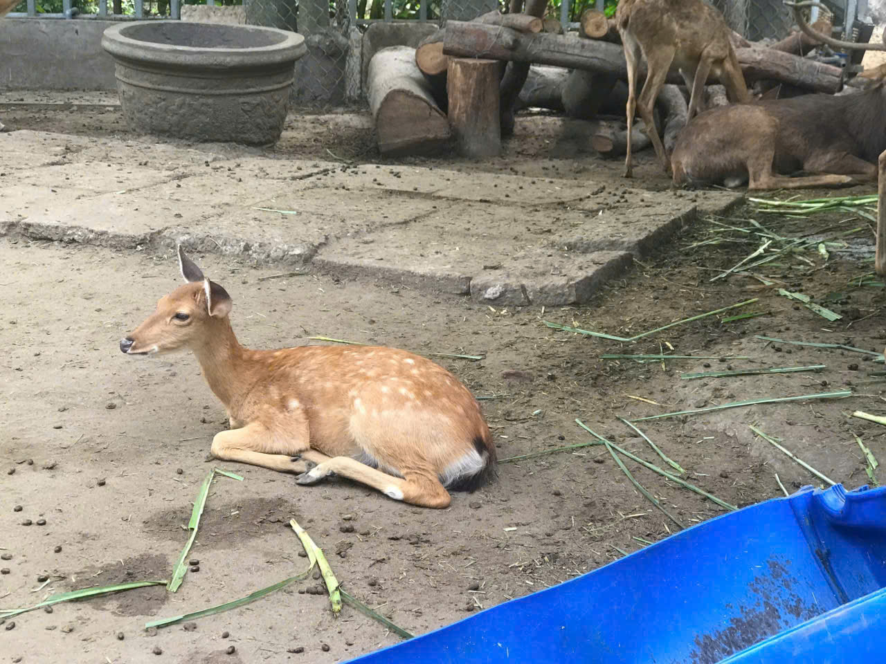

# Khoiletan
Tôi 23 tuổi 
ở thành phố hồ chí minh
tôi là một người vui tính và hòa đồng
sẽ làm 1 người thiết kế chuyên nghiệp
chỉnh sửa ảnh 
3
dự án 1
tên rau sạch
lên dự án bán rau sạch
cùng người bạn khởi nghiệp
canva
hình đầu tiên là dự án 1 

dự án 2
tên ablum về sở thú
khám phá cuộc sống của các con vật
chụp ảnh và tìm hiểu về cuộc sống của chúng
hình thứ 2 và 3 là dự án 2

4 kỹ năng
html, css, javascript,react,python,photoshop

5 email: khoaletan39@gmail.com
facebook khoile
sdt 0333652529

tôi chọn phong cách anime style
các animation
Dark/Light mode
Animation khi cuộn
Hover effect
Typing effect
Particle background
Loading screen
Form liên hệ

Quá đẹp luôn 🔥
Thông tin của bạn đủ để mình build một portfolio anime style cực ổn rồi.

Dưới đây là cấu trúc project trước:

portfolio/
│
├── index.html
├── style.css
├── script.js
│
├── images/
│   ├── rau-sach.png
│   ├── voi.png
│   └── huou.png
BƯỚC 1 — Tạo project trong GitHub Codespaces

Tạo 3 file:

index.html
style.css
script.js

Tạo thêm folder:

images

Sau đó upload 3 hình của bạn vào folder images.

Đổi tên:

hình 1 → rau-sach.png
hình 2 → voi.png
hình 3 → huou.png
BƯỚC 2 — CODE index.html
<!DOCTYPE html>
<html lang="vi">
<head>
  <meta charset="UTF-8">
  <meta name="viewport" content="width=device-width, initial-scale=1.0">
  <title>Lê Tấn Khôi Portfolio</title>

  <link rel="stylesheet" href="style.css">

  
</head>

<body>

  <!-- Loading Screen -->
  

    <h1>Loading Portfolio...</h1>
  

  <!-- Particle Background -->
  

  <!-- Navbar -->
  <nav>
    <h2>Khôi</h2>

    <ul>
      <li><a href="#hero">Home</a></li>
      <li><a href="#about">About</a></li>
      <li><a href="#projects">Projects</a></li>
      <li><a href="#skills">Skills</a></li>
      <li><a href="#contact">Contact</a></li>
    </ul>

    <button id="theme-toggle">🌙</button>
  </nav>

  <!-- HERO -->
  <section id="hero">
    

      <h1>Lê Tấn Khôi</h1>

      <h2 class="typing"></h2>

      

        “Đừng vì hôm nay mà đánh mất ngày mai.”
      

      <a href="#contact" class="btn">
        Liên hệ với tôi
      </a>

    

  </section>

  <!-- ABOUT -->
  <section id="about" class="fade-in">

    <h2>Giới Thiệu</h2>

    

      

        Tôi là sinh viên 23 tuổi sống tại Thành phố Hồ Chí Minh.
        Tôi là người vui tính, hòa đồng và luôn muốn học hỏi thêm nhiều kỹ năng mới.
      

      

        Mục tiêu của tôi là trở thành một nhà thiết kế chuyên nghiệp
        với khả năng sáng tạo và phát triển các sản phẩm đẹp mắt.
      

    

  </section>

  <!-- PROJECTS -->
  <section id="projects" class="fade-in">

    <h2>Dự Án</h2>

    

      <!-- Project 1 -->
      

        

        

          <h3>Rau Sạch</h3>

          

            Dự án xây dựng ý tưởng bán rau sạch cùng người bạn khởi nghiệp.
          

          

            Vai trò: Thiết kế và lên ý tưởng dự án bằng Canva.
          

        

      

      <!-- Project 2 -->
      

        

        

          <h3>Album Về Sở Thú</h3>

          

            Khám phá cuộc sống của các loài động vật thông qua hình ảnh thực tế.
          

          

            Vai trò: Chụp ảnh và tìm hiểu cuộc sống của động vật.
          

        

      

      <!-- Project 3 -->
      

        

        

          <h3>Khoảnh Khắc Thiên Nhiên</h3>

          

            Bộ ảnh ghi lại vẻ đẹp tự nhiên của động vật tại sở thú.
          

          

            Vai trò: Photographer & Editor.
          

        

      

    

  </section>

  <!-- SKILLS -->
  <section id="skills" class="fade-in">

    <h2>Kỹ Năng</h2>

    

      

        HTML
        

      

      

        CSS
        

      

      

        JavaScript
        

      

      

        React
        

      

      

        Python
        

      

      

        Photoshop
        

      

    

  </section>

  <!-- CONTACT -->
  <section id="contact" class="fade-in">

    <h2>Liên Hệ</h2>

    

      
Email: khoaletan39@gmail.com

      
Facebook: khoile

      
SĐT: 0333652529

      <form>

        <input type="text" placeholder="Tên của bạn">

        <input type="email" placeholder="Email">

        <textarea placeholder="Tin nhắn"></textarea>

        <button type="submit">
          Gửi Tin Nhắn
        </button>

      </form>

    

  </section>

  <!-- Footer -->
  <footer>
    
© 2025 Lê Tấn Khôi Portfolio

  </footer>

  <!-- Scripts -->
  

  

</body>
</html>
BƯỚC 3 — CODE style.css
*{
  margin:0;
  padding:0;
  box-sizing:border-box;
  scroll-behavior:smooth;
}

body{
  font-family:Arial, sans-serif;
  background:#0f172a;
  color:white;
  overflow-x:hidden;
  transition:0.5s;
}

body.light{
  background:#f5f5f5;
  color:#111;
}

#particles-js{
  position:fixed;
  width:100%;
  height:100%;
  z-index:-1;
}

nav{
  display:flex;
  justify-content:space-between;
  align-items:center;
  padding:20px 10%;
  position:fixed;
  width:100%;
  background:rgba(0,0,0,0.4);
  backdrop-filter:blur(10px);
  z-index:1000;
}

nav ul{
  display:flex;
  gap:20px;
  list-style:none;
}

nav a{
  color:white;
  text-decoration:none;
  transition:0.3s;
}

nav a:hover{
  color:#00ff99;
}

#theme-toggle{
  background:none;
  border:none;
  color:white;
  font-size:20px;
  cursor:pointer;
}

section{
  min-height:100vh;
  padding:120px 10%;
}

#hero{
  display:flex;
  align-items:center;
  justify-content:center;
  text-align:center;
}

.hero-content h1{
  font-size:70px;
  color:#00ff99;
}

.hero-content h2{
  margin-top:10px;
  font-size:30px;
}

.hero-content p{
  margin:20px 0;
  font-size:20px;
}

.btn{
  display:inline-block;
  padding:12px 25px;
  background:#00ff99;
  color:black;
  border-radius:30px;
  text-decoration:none;
  transition:0.3s;
}

.btn:hover{
  transform:scale(1.1);
}

.about-box,
.contact-box{
  margin-top:30px;
  line-height:1.8;
}

.project-container{
  display:grid;
  grid-template-columns:repeat(auto-fit,minmax(300px,1fr));
  gap:30px;
  margin-top:40px;
}

.project-card{
  background:#1e293b;
  border-radius:20px;
  overflow:hidden;
  transition:0.4s;
}

.project-card:hover{
  transform:translateY(-10px);
}

.project-card img{
  width:100%;
  height:250px;
  object-fit:cover;
}

.project-info{
  padding:20px;
}

.skills-container{
  margin-top:40px;
}

.skill{
  margin-bottom:25px;
}

.bar{
  background:#333;
  height:15px;
  border-radius:20px;
  overflow:hidden;
}

.bar div{
  height:100%;
  background:#00ff99;
}

form{
  display:flex;
  flex-direction:column;
  gap:15px;
  margin-top:20px;
}

input,
textarea{
  padding:15px;
  border:none;
  border-radius:10px;
}

button{
  padding:15px;
  border:none;
  background:#00ff99;
  border-radius:10px;
  cursor:pointer;
}

footer{
  text-align:center;
  padding:20px;
}

.fade-in{
  opacity:0;
  transform:translateY(50px);
  transition:1s;
}

.fade-in.show{
  opacity:1;
  transform:translateY(0);
}

#loader{
  position:fixed;
  width:100%;
  height:100%;
  background:#000;
  display:flex;
  justify-content:center;
  align-items:center;
  z-index:9999;
}

@media(max-width:768px){

  nav{
    flex-direction:column;
    gap:15px;
  }

  .hero-content h1{
    font-size:45px;
  }

}
BƯỚC 4 — CODE script.js
// Loading Screen
window.addEventListener("load", () => {
  document.getElementById("loader").style.display = "none";
});

// Dark Light Mode
const toggleBtn = document.getElementById("theme-toggle");

toggleBtn.addEventListener("click", () => {
  document.body.classList.toggle("light");
});

// Typing Effect
const text = "Sinh viên | Designer | Creative";
let i = 0;

function typing() {

  if(i < text.length){

    document.querySelector(".typing").textContent += text.charAt(i);

    i++;

    setTimeout(typing,100);

  }

}

typing();

// Scroll Animation
const faders = document.querySelectorAll(".fade-in");

window.addEventListener("scroll", () => {

  faders.forEach(item => {

    const top = item.getBoundingClientRect().top;

    if(top < window.innerHeight - 100){

      item.classList.add("show");

    }

  });

});

// Particle Background
particlesJS("particles-js", {

  particles: {
    number: {
      value: 80
    },

    color: {
      value: "#00ff99"
    },

    line_linked: {
      enable: true
    },

    move: {
      speed: 2
    }
  }

});
